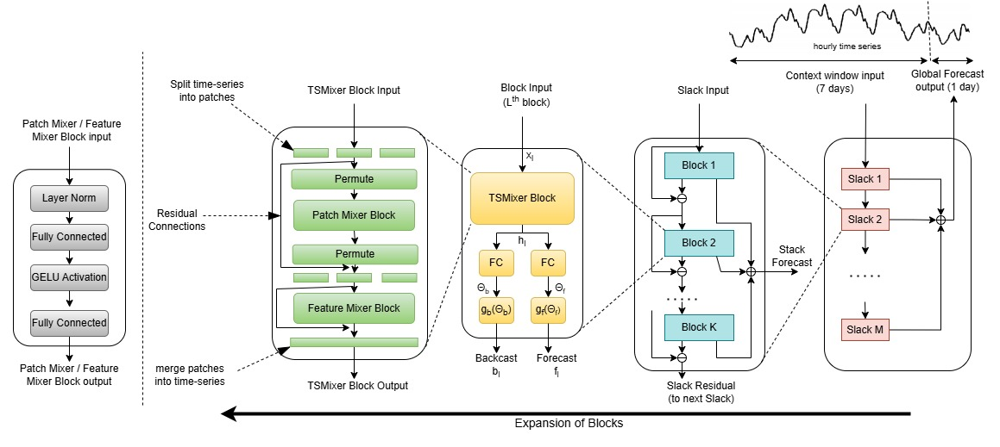

# Mix-BEATS: Mixer-enhanced Basis Expansion Analysis for Load Forecasting
Repository for our new model Mix-BEATS.

## Mix-BEATS Model Overview
Introducing Mix-BEATS, a novel model combining N-BEATS and TSMixer blocks for accurate and efficient short-term load forecasting (STLF) in smart buildings, with fewer parameters and a design optimized for edge-device deployment.

## Results

Results are shown Below.

### Performance Metrics

The table below compares the forecasting performance of Mix-Beats with N-BEATS and TTMS models across multiple datasets. Metrics include Normalized Root Mean Squared Error (NRMSE):

| Model      |   Dataset   | NRMSE  |
|------------|----------   |------- |
| Mix-BEATS  | Commertial  | *20.37*  |
| N-BEATS    | Commertial  | 25.80  |
| TTMs       | Commertial  | 22.36  |
| Mix-BEATS  | Residential | *81.33*  |
| N-BEATS    | Residential | 84.26  |
| TTMs       | Residential | 81.45   | 

### Key Insights

- **Mix-BEATS** outperforms N-BEATS and TTMS on NRMSE metrics, demonstrating its robustness and accuracy for STLF tasks.
- The architecture's focus on task-specific enhancements ensures adaptability to diverse building profiles.

